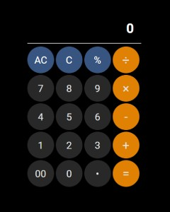

# Calculator

The calculator design is quite popular. I decided to do it in CSS Grid and spice up my version with two different styles. The first for the desktop version and the second for mobile devices, inspired by the iPhone calculator.

Desktop

Mobile

## Technologies

* HTML
* CSS
* JavaScript

## Link

Here you will find a link to calculator made by me: (https://pawel-serafinko.github.io/calculator/)

## What I have learned and what obstacles I encountered

A project where I could practice the basics of CSS Grid. Nowadays, every Java Script exercise is important to me. The challenge was the emerging "wrong operation" alert with unacceptable action.
